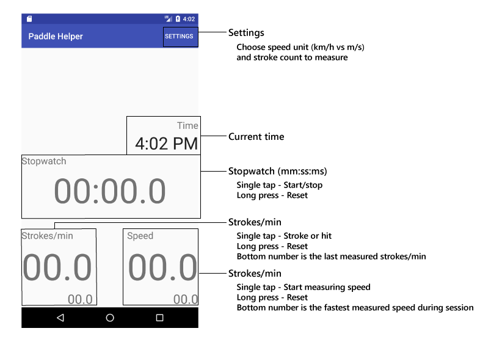

# Paddle Helper

This app is meant to help dragon boat coaches during practices. This app can act as a stopwatch, speedometer, or a stroke per minute counter.

## How to use

If speedometer reads "Null", then the gps is searching for the location of the phone. When first using this feature, the phone may display "Null" in the speedometer for a short moment.